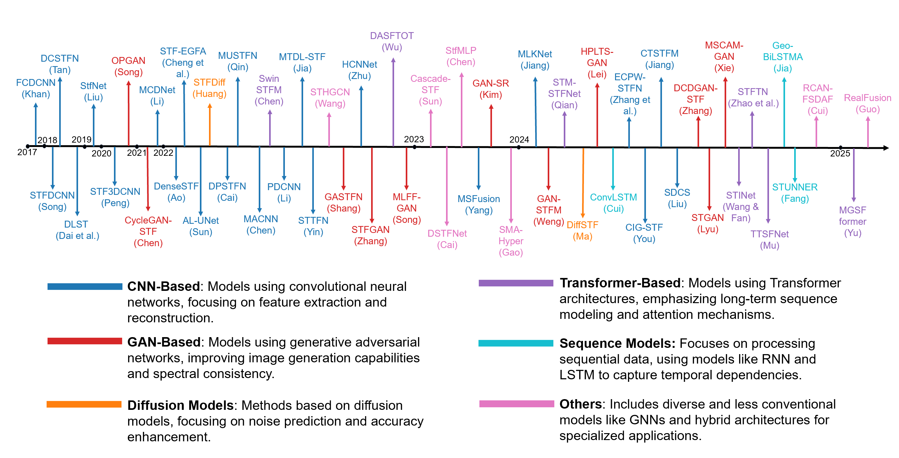
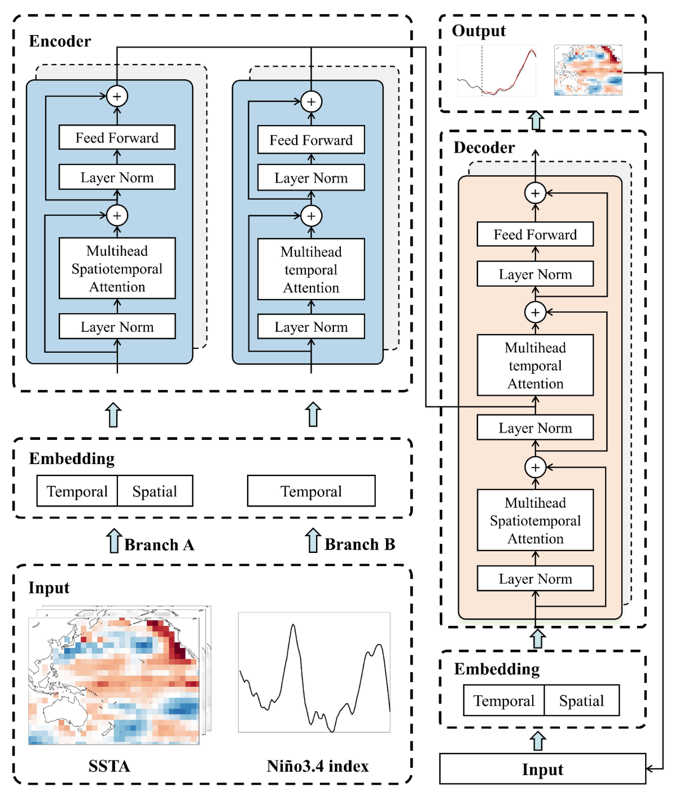
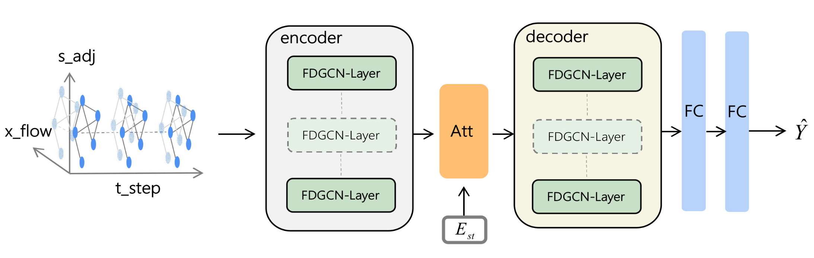
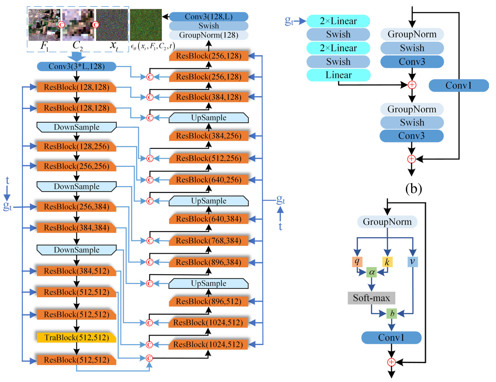
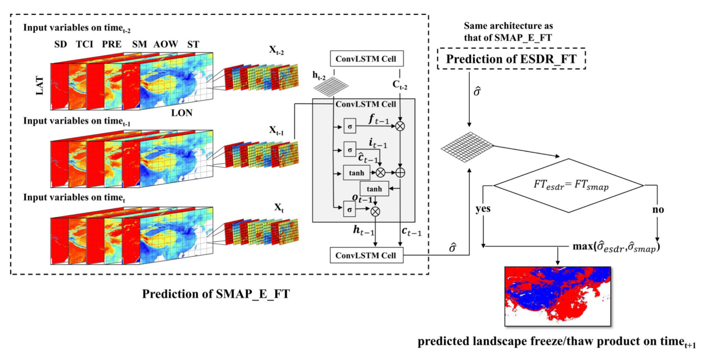

# A Decade of Deep Learning for Remote Sensing Spatiotemporal Fusion: Advances, Challenges, and Opportunities

              

This repository contains a collection of deep learning models for remote sensing spatiotemporal fusion. It includes sections on relevant survey papers, various deep learning model categories, and commonly used datasets in the field. The repository aims to serve as a helpful reference for researchers and practitioners. Paper: [https://arxiv.org/abs/2504.00901v2](https://arxiv.org/abs/2504.00901v2)


Code implementation for deep spatiotemporal fusion models: Please refer to the [code](https://github.com/yc-cui/Deep-Learning-Spatiotemporal-Fusion-Survey/tree/main/code) folder.


If this work is helpful, please kindly cite our paper:

```bibtex
@misc{sun2025decadedeeplearningremote,
      title={A Decade of Deep Learning for Remote Sensing Spatiotemporal Fusion: Advances, Challenges, and Opportunities}, 
      author={Enzhe Sun and Yongchuan Cui and Peng Liu and Jining Yan},
      year={2025},
      eprint={2504.00901},
      archivePrefix={arXiv},
      primaryClass={cs.CV},
      url={https://arxiv.org/abs/2504.00901}, 
}
```


<p align="center">
  
</p>


<p align="center">
  
</p>


# Table of contents

- [ Survey](#head0)
- [ Deep Learning Models](#head1)
  - [ CNN](#head1-1)
  - [ Transformer](#head1-2)
  - [ GAN](#head1-3)
  - [ Diffusion Model](#head1-4)
  - [ Sequence Model](#head1-5)
  - [ Others](#head1-6)
- [ Datasets](#head2)

<span id="head0"></span>

# Survey

- `[RS 2018]` [[paper]](https://www.mdpi.com/2072-4292/10/4/527)
  X. Zhu, F. Cai, J. Tian and T. Williams, "**Spatiotemporal Fusion of Multisource Remote Sensing Data: Literature Survey, Taxonomy, Principles, Applications, and Future Directions**," *<ins>Remote Sensing</ins>*, vol. 10, no. 4, pp. 527, Mar. 2018, doi: 10.3390/rs10040527.

- `[RS 2019]` [[paper]](https://www.mdpi.com/2072-4292/11/7/818)
  M. Belgiu and A. Stein, "**Spatiotemporal Image Fusion in Remote Sensing**," *<ins>Remote Sensing</ins>*, vol. 11, no. 7, pp. 818, Jan. 2019, doi: 10.3390/rs11070818.

- `[SCIS 2020]` [[paper]](https://link.springer.com/10.1007/s11432-019-2785-y)
  J. Li, Y. Li, L. He, J. Chen and A. Plaza, "**Spatio-Temporal Fusion for Remote Sensing Data: An Overview and New Benchmark**," *<ins>Science China Information Sciences</ins>*, vol. 63, no. 4, pp. 140301, Apr. 2020, doi: 10.1007/s11432-019-2785-y.

- `[GRSM 2021]` [[paper]](https://ieeexplore.ieee.org/document/9353399/?arnumber=9353399)
  P. Wu, Z. Yin, C. Zeng, S. B. Duan, F. M. Göttsche, X. Ma, X. Li, H. Yang and H. Shen, "**Spatially Continuous and High-Resolution Land Surface Temperature Product Generation: A Review of Reconstruction and Spatiotemporal Fusion Techniques**," *<ins>IEEE Geoscience and Remote Sensing Magazine</ins>*, vol. 9, no. 3, pp. 112-137, Sep. 2021, doi: 10.1109/MGRS.2021.3050782.

- `[JAG 2022]` [[paper]](https://linkinghub.elsevier.com/retrieve/pii/S1569843222001248)
  J. Li, D. Hong, L. Gao, J. Yao, K. Zheng, B. Zhang and J. Chanussot, "**Deep Learning in Multimodal Remote Sensing Data Fusion: A Comprehensive Review**," *<ins>International Journal of Applied Earth Observation and Geoinformation</ins>*, vol. 112, pp. 102926, Aug. 2022, doi: 10.1016/j.jag.2022.102926.

- `[Sensors 2025]` [[paper]](https://www.mdpi.com/1424-8220/25/4/1093)
  Lian, Z., Zhan, Y., Zhang, W., Wang, Z., Liu, W., & Huang, X., "**Recent Advances in Deep Learning-Based Spatiotemporal Fusion Methods for Remote Sensing Images**," *<ins>Sensors</ins>*, vol. 25, no. 4, pp. 1093, Feb. 2025, doi: 10.3390/s25041093.


<!-- Add your survey papers here -->

<span id="head1"></span>

# Deep Learning Models

<span id="head1-1"></span>

## CNN

- `[JSTARS 2018 STFDCNN]` [[paper]](https://ieeexplore.ieee.org/document/8291042/?arnumber=8291042) 
   
  H. Song, Q. Liu, G. Wang, R. Hang and B. Huang, "**Spatiotemporal Satellite Image Fusion 
  Using Deep Convolutional Neural Networks**," *<ins>IEEE J. Sel. Top. Appl. Earth Obs. 
  Remote Sens.</ins>*, vol. 11, no. 3, pp. 821-829, Mar. 2018, doi: 10.1109/JSTARS.2018.2797894.

  

- `[TGRS 2019 StfNet]` [[paper]](https://ieeexplore.ieee.org/document/8693668/?arnumber=8693668)
  
  X. Liu, C. Deng, J. Chanussot, D. Hong and B. Zhao, "**StfNet: A Two-Stream Convolutional 
  Neural Network for Spatiotemporal Image Fusion**," *<ins>IEEE Trans. Geosci. Remote 
  Sens.</ins>*, vol. 57, no. 9, pp. 6552-6564, Sep. 2019, doi: 10.1109/TGRS.2019.2907310.

  

- `[RS 2019 EDCSTFN]` [[paper]](https://www.mdpi.com/2072-4292/11/24/2898)
  [[code]](https://github.com/theonegis/edcstfn)    
  Z. Tan, L. Di, M. Zhang, L. Guo and M. Gao, "**An Enhanced Deep Convolutional Model for Spatiotemporal Image Fusion**," *<ins>REMOTE Sens.</ins>*, vol. 11, no. 24, Dec. 2019, doi: 10.3390/rs11242898.

  

- `[RS 2020 STF3DCNN]` [[paper]](https://www.mdpi.com/2072-4292/12/23/3888)
  
  M. Peng, L. Zhang, X. Sun, Y. Cen and X. Zhao, "**A Fast Three-Dimensional Convolutional Neural Network-Based Spatiotemporal Fusion Method (STF3DCNN) Using a Spatial-Temporal-Spectral Dataset**," *<ins>Remote Sens.</ins>*, vol. 12, no. 23, pp. 3888, Jan. 2020, doi: 10.3390/rs12233888.

  

- `[TGRS 2021 STTFN]` [[paper]](https://ieeexplore.ieee.org/document/9115890/?arnumber=9115890)
  
  Z. Yin, P. Wu, G. M. Foody, Y. Wu, Z. Liu, Y. Du and F. Ling, "**Spatiotemporal Fusion of Land Surface Temperature Based on a Convolutional Neural Network**," *<ins>IEEE Trans. Geosci. Remote Sens.</ins>*, vol. 59, no. 2, pp. 1808-1822, Feb. 2021, doi: 10.1109/TGRS.2020.2999943.

  

- `[JSTARS 2021 MCDNet]` [[paper]](https://ieeexplore.ieee.org/document/9540272/)
  
  W. Li, C. Yang, Y. Peng and X. Zhang, "**A Multi-Cooperative Deep Convolutional Neural Network for Spatiotemporal Satellite Image Fusion**," *<ins>IEEE J. Sel. Top. Appl. EARTH Obs. REMOTE Sens.</ins>*, vol. 14, pp. 10174-10188, 2021, doi: 10.1109/JSTARS.2021.3113163.

  

- `[JSTARS 2021 MOST]` [[paper]](https://ieeexplore.ieee.org/document/9439158/)
  
  J. Wei, W. Tang and C. He, "**Enblending Mosaicked Remote Sensing Images With Spatiotemporal Fusion of Convolutional Neural Networks**," *<ins>IEEE J. Sel. Top. Appl. Earth Observations Remote Sensing</ins>*, vol. 14, pp. 5891-5902, 2021, doi: 10.1109/JSTARS.2021.3082619.

  

- `[JSTARS 2022 MUSTFN]` [[paper]](https://linkinghub.elsevier.com/retrieve/pii/S1569843222003016)
  [[code]](https://github.com/qpyeah/MUSTFN)    
  P. Qin, H. Huang, H. Tang, J. Wang and C. Liu, "**MUSTFN: A Spatiotemporal Fusion Method for Multi-Scale and Multi-Sensor Remote Sensing Images Based on a Convolutional Neural Network**," *<ins>Int. J. Appl. EARTH Obs. GEOINFORMATION</ins>*, vol. 115, Dec. 2022, doi: 10.1016/j.jag.2022.103113.

  

- `[TGRS 2022 DenseSTF]` [[paper]](https://ieeexplore.ieee.org/document/9721293/?arnumber=9721293)
  [[code]](https://github.com/sysu-xin-lab/DenseSTF)    
  Z. Ao, Y. Sun, X. Pan and Q. Xin, "**Deep Learning-Based Spatiotemporal Data Fusion Using a Patch-to-Pixel Mapping Strategy and Model Comparisons**," *<ins>IEEE Trans. Geosci. Remote Sens.</ins>*, vol. 60, pp. 1-18, 2022, doi: 10.1109/TGRS.2022.3154406.

  

- `[RS 2022 STF-EGFA]` [[paper]](https://www.mdpi.com/2072-4292/14/13/3057)
  
  F. Cheng, Z. Fu, B. Tang, L. Huang, K. Huang and X. Ji, "**STF-EGFA: A Remote Sensing Spatiotemporal Fusion Network with Edge-Guided Feature Attention**," *<ins>Remote Sens.</ins>*, vol. 14, no. 13, pp. 3057, Jan. 2022, doi: 10.3390/rs14133057.

  

- `[TGRS 2022 HCNNet]` [[paper]](https://ieeexplore.ieee.org/document/9781404/)
  
  Z. Zhu, Y. Tao and X. Luo, "**HCNNet: A Hybrid Convolutional Neural Network for Spatiotemporal Image Fusion**," *<ins>IEEE Trans. Geosci. Remote Sens.</ins>*, vol. 60, pp. 1-18, 2022, doi: 10.1109/TGRS.2022.3177749.

  

- `[RS 2022 MACNN]` [[paper]](https://linkinghub.elsevier.com/retrieve/pii/S2666017222000244)
  
  Y. Chen and Y. Ge, "**Spatiotemporal Image Fusion Using Multiscale Attention-Aware Two-Stream Convolutional Neural Networks**," *<ins>Sci. Remote Sens.</ins>*, vol. 6, Dec. 2022, doi: 10.1016/j.srs.2022.100062.

  

- `[ISPRS 2024 ECPW-STFN]` [[paper]](https://linkinghub.elsevier.com/retrieve/pii/S092427162400176X) [[code]](https://github.com/lixinghua5540/ECPW-STFN)  
X. Zhang, S. Li, Z. Tan and X. Li, "**Enhanced Wavelet Based Spatiotemporal Fusion Networks Using Cross-Paired Remote Sensing Images**," 
*<ins>ISPRS Journal of Photogrammetry and Remote Sensing</ins>*, vol. 211, pp. 281-297, May 2024, doi: 10.1016/j.isprsjprs.2024.04.016.


- `[JSTARS 2024 MLKNet]` [[paper]](https://ieeexplore.ieee.org/document/10342633/)  
H. Jiang, Y. R. Qian, G. Q. Yang and H. Liu, "**MLKNet: Multi-Stage for Remote Sensing Image Spatiotemporal Fusion Network Based on a Large Kernel Attention**," 
*<ins>IEEE J. Sel. Top. Appl. Earth Obs. Remote Sens.</ins>*, vol. 17, pp. 1257-1268, 2024, doi: 10.1109/JSTARS.2023.3338978.


- `[JSTARS 2024 RCAN-FSDAF]` [[paper]](https://ieeexplore.ieee.org/document/10480541/)  
D. Cui, S. Wang, C. Zhao and H. Zhang, "**A Novel Remote Sensing Spatiotemporal Data Fusion Framework Based on the Combination of Deep-Learning Downscaling and Traditional Fusion Algorithm**," 
*<ins>IEEE J. Sel. Top. Appl. Earth Obs. Remote Sens.</ins>*, vol. 17, pp. 7957-7970, 2024, doi: 10.1109/JSTARS.2024.3382136.


- `[JSTARS 2024 CTSTFM]` [[paper]](https://ieeexplore.ieee.org/document/10614805/)  
M. Jiang and H. Shao, "**A CNN-Transformer Combined Remote Sensing Imagery Spatiotemporal Fusion Model**," 
*<ins>IEEE J. Sel. Top. Appl. Earth Obs. Remote Sens.</ins>*, vol. 17, pp. 13995-14009, 2024, doi: 10.1109/JSTARS.2024.3435739.


<span id="head1-2"></span>

## Transformer

- `[TGRS 2022 SwinSTFM]` [[paper]](https://ieeexplore.ieee.org/document/9795183/) [[code]](https://github.com/LouisChen0104/swinstfm)  
  G. Chen, P. Jiao, Q. Hu, L. Xiao and Z. Ye, "**SwinSTFM: Remote Sensing Spatiotemporal Fusion Using Swin Transformer**," *<ins>IEEE Trans. Geosci. Remote Sens.</ins>*, vol. 60, pp. 1-18, 2022, doi: 10.1109/TGRS.2022.3182809.

  

- `[TGRS 2024 TTSFNet]` [[paper]](https://ieeexplore.ieee.org/document/10644046/) 
  J. D. Mu, J. A. Yang, C. Y. Wang and Y. J. Jia, "**Spatiotemporal Fusion Network Based on Improved Transformer for Inverting Subsurface Thermohaline Structure**," *<ins>IEEE Trans. Geosci. Remote Sens.</ins>*, vol. 62, 2024, doi: 10.1109/TGRS.2024.3446805.

  

- `[TGRS 2024 STINet]` [[paper]](https://ieeexplore.ieee.org/document/10636344/) 
  S. Wang and F. Fan, "**STINet: Vegetation Changes Reconstruction Through a Transformer-Based Spatiotemporal Fusion Approach in Remote Sensing**," *<ins>IEEE Trans. Geosci. Remote Sens.</ins>*, vol. 62, pp. 1-16, 2024, doi: 10.1109/TGRS.2024.3443258.

  

- `[JSTARS 2024 STFTN]` [[paper]](https://ieeexplore.ieee.org/document/10643249/) 
  A. Zhao, M. Qin, S. Wu, R. Liu and Z. Du, "**ENSO Forecasts With Spatiotemporal Fusion Transformer Network**," *<ins>IEEE J. Sel. Top. Appl. Earth Observations Remote Sens.</ins>*, vol. 17, pp. 17066-17074, 2024, doi: 10.1109/JSTARS.2024.3447356.

  

- `[Information Fusion 2025 MGSFformer]` [[paper]](https://linkinghub.elsevier.com/retrieve/pii/S1566253524003853) [[code]](https://github.com/ChengqingYu/MGSFformer)  
  C. Yu, F. Wang, Y. Wang, Z. Shao, T. Sun, D. Yao and Y. Xu, "**MGSFformer: A Multi-Granularity Spatiotemporal Fusion Transformer for Air Quality Prediction**," *<ins>Information Fusion</ins>*, vol. 113, pp. 102607, Jan. 2025, doi: 10.1016/j.inffus.2024.102607.

  

<span id="head1-3"></span>

## GAN

- `[TGRS 2022 MLFF-GAN]` [[paper]](https://ieeexplore.ieee.org/document/9781347/) [[code]](https://github.com/songbingze/MLFF-GAN)  
  B. Song, P. Liu, J. Li, L. Wang, L. Zhang, G. He, L. Chen and J. Liu, "**MLFF-GAN: A Multilevel Feature Fusion With GAN for Spatiotemporal Remote Sensing Images**," *<ins>IEEE Trans. Geosci. Remote Sens.</ins>*, vol. 60, pp. 1-16, 2022, doi: 10.1109/TGRS.2022.3169916.

  

- `[TGRS 2022 GAN-STFM]` [[paper]](https://ieeexplore.ieee.org/document/9336033/) [[code]](https://github.com/theonegis/ganstfm)  
  Z. Tan, M. Gao, X. Li and L. Jiang, "**A Flexible Reference-Insensitive Spatiotemporal Fusion Model for Remote Sensing Images Using Conditional Generative Adversarial Network**," *<ins>IEEE Trans. Geosci. Remote Sens.</ins>*, vol. 60, pp. 1-13, 2022, doi: 10.1109/TGRS.2021.3050551.

  

- `[JSTARS 2024 SS-STFM]` [[paper]](https://ieeexplore.ieee.org/document/10478639/) 
  C. Y. Weng, Y. L. Zhan, X. F. Gu, J. Yang, Y. Liu, H. Guo, Z. L. Lian, S. Y. Zhang, Z. J. Wang and X. C. Zhao, "**The Spatially Seamless Spatiotemporal Fusion Model Based on Generative Adversarial Networks**," *<ins>IEEE J. Sel. Top. Appl. Earth Obs. Remote Sens.</ins>*, vol. 17, pp. 12760-12771, 2024, doi: 10.1109/JSTARS.2024.3381185.

  

- `[TGRS 2024 HPLTS-GAN]` [[paper]](https://ieeexplore.ieee.org/document/10559990/) 
  D. Lei, Q. Zhu, Y. Li, J. Tan, S. Wang, T. Zhou and L. Zhang, "**HPLTS-GAN: A High-Precision Remote Sensing Spatiotemporal Fusion Method Based on Low Temporal Sensitivity**," *<ins>IEEE Trans. Geosci. Remote Sens.</ins>*, vol. 62, pp. 1-16, 2024, doi: 10.1109/TGRS.2024.3416152.

  

- `[JSTARS 2024 DCDGAN-STF]` [[paper]](https://ieeexplore.ieee.org/document/10707182/) [[code]](https://github.com/zhangyanxa/DCDGAN-STF)  
  Y. Zhang, R. B. Fan, P. P. Duan, J. F. Dong and Z. Y. Lei, "**DCDGAN-STF: A Multiscale Deformable Convolution Distillation GAN for Remote Sensing Image Spatiotemporal Fusion**," *<ins>IEEE J. Sel. Top. Appl. Earth Obs. Remote Sens.</ins>*, vol. 17, pp. 19436-19450, 2024, doi: 10.1109/JSTARS.2024.3476153.

  

<span id="head1-4"></span>

## Diffusion Model

- `[Applied Sciences 2022 MFDGCN]` [[paper]](https://www.mdpi.com/2076-3417/12/5/2688) 
  Z. Cui, J. Zhang, G. Noh and H. J. Park, "**MFDGCN: Multi-Stage Spatio-Temporal Fusion Diffusion Graph Convolutional Network for Traffic Prediction**," *<ins>Applied Sciences</ins>*, vol. 12, no. 5, pp. 2688, Jan. 2022, doi: 10.3390/app12052688.

  
   
- `[Information Fusion 2024 STFDiff]` [[paper]](https://linkinghub.elsevier.com/retrieve/pii/S1566253524002835) 
  [[code]](https://github.com/prowDIY/STF)    
  H. Huang, W. He, HY Zhang, Y. Xia, LP Zhang, "**STFDiff: Remote Sensing Image Spatiotemporal Fusion with Diffusion Models**," *<ins>Inf. FUSION</ins>*, vol. 111, Nov. 2024, doi: 10.1016/j.inffus.2024.102505.

  

- `[GRSL 2024 DiffSTF]` [[paper]](https://ieeexplore.ieee.org/document/10474355/) 
   
  Y. Ma, Q. Wang, J. Wei, "**Spatiotemporal Fusion via Conditional Diffusion Model**," *<ins>IEEE Geosci. Remote Sens. Lett.</ins>*, vol. 21, pp. 1-5, 2024, doi: 10.1109/LGRS.2024.3378715.

  

- `[JAG 2024 DiffSTSF]` [[paper]](https://linkinghub.elsevier.com/retrieve/pii/S1569843224001067) 
  [[code]](https://github.com/isstncu/gf1fusion)    
  J. Wei, L. Gan, W. Tang, M. Li, Y. Song, "**Diffusion Models for Spatio-Temporal-Spectral Fusion of Homogeneous Gaofen-1 Satellite Platforms**," *<ins>International Journal of Applied Earth Observation and Geoinformation</ins>*, vol. 128, Apr. 2024, pp. 103752, doi: 10.1016/j.jag.2024.103752.

  

<span id="head1-5"></span>

## Sequence Model

- `[JHYDROL 2020 CNN-LSTM]` [[paper]](https://linkinghub.elsevier.com/retrieve/pii/S0022169420301244) 
   
  H. Wu, Q. Yang, J. Liu, G. Wang, "**A Spatiotemporal Deep Fusion Model for Merging Satellite and Gauge Precipitation in China**," *<ins>Journal of Hydrology</ins>*, vol. 584, May 2020, pp. 124664, doi: 10.1016/j.jhydrol.2020.124664.

  

- `[IGARSS 2024 ConvLSTM]` [[paper]](https://ieeexplore.ieee.org/document/10641699/) 
   
  H. Cui, L. Chai, H. Li, S. Zhao, "**Spatiotemporal Fusion of Soil Freeze/Thaw Datasets at Decision-Level Based on Convolutional Long Short-Term Memory Network**," *<ins>IGARSS 2024 - 2024 IEEE Int. Geosci. Remote Sens. Symp.</ins>*, pp. 8983-8986, Jul. 2024, doi: 10.1109/IGARSS53475.2024.10641699.

  

- `[APR 2024 Geo-BiLSTMA]` [[paper]](https://linkinghub.elsevier.com/retrieve/pii/S1309104224000722) 
   
  T. Jia, G. Cheng, Z. Chen, J. Yang, Y. Li, "**Forecasting Urban Air Pollution Using Multi-Site Spatiotemporal Data Fusion Method (Geo-BiLSTMA)**," *<ins>Atmospheric Pollution Research</ins>*, vol. 15, no. 6, Jun. 2024, pp. 102107, doi: 10.1016/j.apr.2024.102107.

  

<span id="head1-6"></span>

## Others

- `[KNOSYS 2022 STHGCN]` [[paper]](https://linkinghub.elsevier.com/retrieve/pii/S0950705122010784) 
   
  J. Wang, W. Wang, W. Yu, X. Liu, K. Jia, X. Li, M. Zhong, Y. Sun, Y. Xu, "**STHGCN: A Spatiotemporal Prediction Framework Based on Higher-Order Graph Convolution Networks**," *<ins>KNOSYS</ins>*, vol. 258, pp. 109985, Dec. 2022, doi: 10.1016/j.knosys.2022.109985.

  

- `[JSTARS 2022 MSFusion]` [[paper]](https://ieeexplore.ieee.org/document/9786792/?arnumber=9786792) 
   
  G. Yang, Y. Qian, H. Liu, B. Tang, R. Qi, Y. Lu, J. Geng, "**MSFusion: Multistage for Remote Sensing Image Spatiotemporal Fusion Based on Texture Transformer and Convolutional Neural Network**," *<ins>IEEE J. Sel. Top. Appl. Earth Obs. Remote Sens.</ins>*, vol. 15, pp. 4653-4666, 2022, doi: 10.1109/JSTARS.2022.3179415.

  

- `[GRSL 2023 StfMLP]` [[paper]](https://ieeexplore.ieee.org/document/9999642/) 
  [[code]](https://github.com/luhailaing-max/StfMLP-master)  
  G. S. Chen, H. L. Lu, D. L. Di, L. H. Li, M. Emam, W. P. Jing, "**StfMLP: Spatiotemporal Fusion Multilayer Perceptron for Remote-Sensing Images**," *<ins>IEEE Geoscience and Remote Sensing Letters</ins>*, vol. 20, 2023, doi: 10.1109/LGRS.2022.3230720.

  

- `[ISPRS 2023 DSTFNet]` [[paper]](https://linkinghub.elsevier.com/retrieve/pii/S0924271623002630) 
   
  Z. Cai, Q. Hu, X. Zhang, J. Yang, H. Wei, J. Wang, Y. Zeng, G. Yin, W. Li, L. You, B. Xu, Z. Shi, "**Improving Agricultural Field Parcel Delineation with a Dual Branch Spatiotemporal Fusion Network by Integrating Multimodal Satellite Data**," *<ins>ISPRS Journal of Photogrammetry and Remote Sensing</ins>*, vol. 205, pp. 34-49, Nov. 2023, doi: 10.1016/j.isprsjprs.2023.09.021.

  

- `[JSTARS 2024 SDCS]` [[paper]](https://ieeexplore.ieee.org/document/10696963/) 
  [[code]](https://github.com/yc-cui/SDCS)  
  P. Liu, L. Wang, J. Chen, Y. Cui, "**Semiblind Compressed Sensing: A Bidirectional-Driven Method for Spatiotemporal Fusion of Remote Sensing Images**," 
  *<ins>IEEE J. Sel. Top. Appl. Earth Obs. Remote Sens.</ins>*, vol. 17, pp. 19048-19066, 2024, doi: 10.1109/JSTARS.2024.3463750.

    

- `[RSE 2025 RealFusion]` [[paper]](https://linkinghub.elsevier.com/retrieve/pii/S0034425725000938) 
   
  D. Guo, Z. Li, X. Gao, M. Gao, C. Yu, C. Zhang and W. Shi, "**RealFusion: A Reliable Deep Learning-Based Spatiotemporal Fusion Framework for Generating Seamless Fine-Resolution Imagery**," *<ins>Remote Sensing of Environment</ins>*, vol. 321, pp. 114689, May 2025, doi: 10.1016/j.rse.2025.114689.

  
<span id="head2"></span>

# Datasets

This section contains commonly used datasets for remote sensing spatiotemporal fusion research.

## Earth Observation Datasets

- **CIA (Coleambally Irrigation Area)** [[Link]](https://data.csiro.au/collections/collection/CIcsiro:5846v3)
  - **Source**: Landsat-7 ETM+, MODIS
  - **Resolution**: 30m (Landsat), 500m (MODIS), 16 days revisit
  - **Region**: Coleambally, Australia

- **LGC (Lower Gwydir Catchment)** [[Link]](https://data.csiro.au/collections/collection/CIcsiro:5847v003)
  - **Source**: Landsat-5 TM, MODIS
  - **Resolution**: 30m (Landsat), 500m (MODIS), 16 days revisit
  - **Region**: Lower Gwydir, Australia

- **Daxing Dataset** [[Link]](https://pan.baidu.com/disk/main#/index?category=all&path=%2FDatasets)
  - **Source**: Landsat-8 OLI, MODIS
  - **Resolution**: 30m (Landsat), 500m (MODIS), 8 days revisit
  - **Region**: Daxing, Beijing, China

- **AHB (Ar Horqin Banner)** [[Link]](https://pan.baidu.com/disk/main#/index?category=all&path=%2FDatasets)
  - **Source**: Landsat-8 OLI, MOD09GA
  - **Resolution**: 30m (Landsat), 500m (MODIS), 16 days revisit
  - **Region**: Ar Horqin Banner, China

- **Tianjin Dataset** [[Link]](https://pan.baidu.com/disk/main#/index?category=all&path=%2FDatasets)
  - **Source**: Landsat-8 OLI, MOD02HKM
  - **Resolution**: 30m (Landsat), 500m (MODIS), 16 days revisit
  - **Region**: Tianjin, China

- **BC (Butte County)** [[Link]](https://www.esa.int/Applications/Observing_the_Earth/Copernicus/Sentinel-2)
  - **Source**: Sentinel-2 MSI, Sentinel-3 OLCI
  - **Resolution**: 10m (S2), 300m (S3), Monthly
  - **Region**: Southwest Butte County, California

- **IC (Imperial County)** [[Link]](https://www.esa.int/Applications/Observing_the_Earth/Copernicus/Sentinel-2)
  - **Source**: Sentinel-2 MSI, Sentinel-3 OLCI
  - **Resolution**: 10m (S2), 300m (S3), Monthly
  - **Region**: Imperial County, California

- **S2 (Sentinel-2)** [[Link]](https://scilb.copernicus.eu)
  - **Source**: Sentinel-2
  - **Resolution**: 10m, 5-day revisit
  - **Region**: Dafeng, China

- **GOCI-II** [[Link]](https://www.nosc.go.kr/)
  - **Source**: GOCI-II Satellite
  - **Resolution**: 500m, hourly
  - **Region**: Dafeng, China

- **Wuhan Dataset** [[Link]](https://github.com/lixinghua5540/Wuhan-dataset)
  - **Source**: GaoFen, Landsat
  - **Resolution**: 8m (GF), 30m (Landsat)
  - **Region**: Wuhan, China

- **MOD09GA** [[Link]](https://ladsweb.modaps.eosdis.nasa.gov)
  - **Source**: MODIS
  - **Resolution**: 500m, Monthly
  - **Region**: North China Plain

## Ocean and Meteorological Datasets

- **OISST** [[Link]](https://www.ncei.noaa.gov/products/optimum-interpolation-sst)
  - **Source**: AVHRR, Buoy, Ship
  - **Resolution**: 0.25° × 0.25°, Daily
  - **Region**: Global Ocean

- **OSTIA** [[Link]](http://marine.copernicus.eu/services-portfolio/access-to-products/)
  - **Source**: Multi-satellite IR, MW, Buoy
  - **Resolution**: 0.05° × 0.05°, Daily
  - **Region**: Global Ocean

- **G1SST** [[Link]](https://podaac.jpl.nasa.gov/dataset/JPL_OUROCEAN-L4UHfnd-GLOB-G1SST)
  - **Source**: Geostationary, Polar Satellites
  - **Resolution**: 0.01° × 0.01°, Daily
  - **Region**: Global Ocean

- **EARS** [[Link]](https://rda.ucar.edu)
  - **Source**: ECMWF Model
  - **Resolution**: 0.25° × 0.25°, Hourly
  - **Region**: Global Ocean

- **In-situ** [[Link]](http://www.nifs.go.kr/kodc)
  - **Source**: Buoy Measurements
  - **Resolution**: 16 Stations, Hourly
  - **Region**: Korean waters

- **TRMM** [[Link]](https://pmm.nasa.gov/data-access/downloads/trmm)
  - **Source**: NASA GSFC PPS
  - **Resolution**: 0.25°, 3-hourly
  - **Region**: 50°N--50°S

- **GridSat** [[Link]](https://www.ncdc.noaa.gov/gridsat/gridsat-index.php)
  - **Source**: NOAA
  - **Resolution**: 0.07°, 3-hourly
  - **Region**: 70°S--70°N

- **Rain** [[Link]](http://data.cma.cn/)
  - **Source**: CMDC (China)
  - **Resolution**: Point, 12-hourly
  - **Region**: China

- **DEM** [[Link]](http://srtm.csi.cgiar.org/srtmdata/)
  - **Source**: USGS, NASA SRTM
  - **Resolution**: 90m, N/A
  - **Region**: 60°N--56°S

## Multi-source Integrations

- **Terra** [[Link]](https://www.selectdataset.com/dataset/5813a4f2da636c4f1c24dac729fab5e0)
  - **Source**: Multi-source
  - **Resolution**: 0.1°, 3-hourly
  - **Region**: Global
